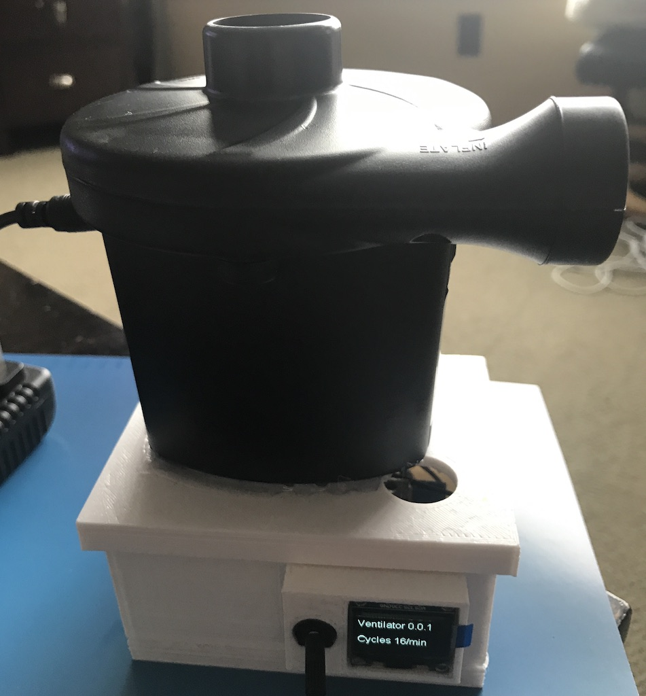
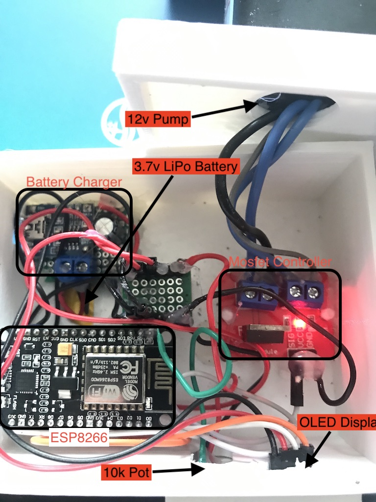

# Ventilator firmware, steps & shopping list

This project is based on https://github.com/jcl5m1/ventilator. 

# Version 0.1.0
### Changes from 0.0.1,
- additional 12v pump for the exhale phase
- controller for the exhale pump
- button to switch between adjusting the exhale and inhale cycle
- software changes,
  - display shows the cycles/min of the inhale phase
  - display shows the cycles/min of the exhale phase
  - enables pump between exhale and inhale based on the phases' cycle setting

#### Display & Adjustment
The display shows two things
1. what `Mode` the ventilator is currently in; exhale or inhale.
2. the cycles per minute for both modes

The annotations in this image; Potentiometer & Button are used to adjust the ventilator.
The button will switch the mode between inhale or exhale, while turning the potentiometer will adjust the cycles for the active mode.


## Shopping List

#### Required
*Almost all of these can be swapped out with similar components.*

- ESP8266 (any ESP8266 will do)
  - [Amazon](https://www.amazon.com/HiLetgo-Internet-Development-Wireless-Micropython/dp/B081CSJV2V)

- 12V air pump (make sure it is 12 volts and has a 2 amp AC power adapter) - Need 2
  - [Amazon](https://www.amazon.com/Electric-Portable-Quick-Fill-Inflator-Inflatable/dp/B074NZY3SQ)
  
- MOSFET 12v controller (can be substituted with a relay) - Need 2
  - [Amazon](https://www.amazon.com/HiLetgo-IRF520-MOSFET-Arduino-Raspberry/dp/B01I1J14MO)

- Potentiometer 10k (can be substituted with lower resistances)
  - [Amazon](https://www.amazon.com/Adafruit-Potentiometer-Breadboard-Friendly-ADA562/dp/B00NAY3O88)
  
- Button
  - [Amazon](https://www.amazon.com/GZFY-6x6x4-5mm-Momentary-Tactile-Button/dp/B01N6GU7TA)
    
- OLED Display
  - [Amazon](https://www.amazon.com/IZOKEE-Display-SSD1306-Raspberry-Yellow-Blue-IIC/dp/B076PDVFQD)
  
- CPAP tube (6ft with a 15cm diameter) - Need 2
  - [Amazon](https://www.amazon.com/Premium-Universal-CPAP-Tubing-Hose/dp/B01N4RGZ80)
  
- 3D printer for mouth piece
  - TODO   

#### Optional

- 3.7v LiPo battery, 800mAh or higher (alternative, keep ESP8266 attached to powered USB)
  - [Amazon](https://www.amazon.com/dp/B07H6GDP95)
  
- TP4056 LiPo charger module
  - [Amazon](https://www.amazon.com/dp/B01DRT4PWY)
  

# Version 0.0.1
Version 0.0.1 of this project has a basic/optional LED display and adjusts to a range of ventilation breathing cycles.

Ventilator cycles between a range of breathing cycles as shown on the display


Quick circuit using a glue gun and Dupont connectors

*MOSFET(left of red LED) is not regulating voltage and isn't generating heat*

Simple circuit without battery powered board


## Shopping List

##### Required

- ESP8266 (any ESP8266 will do)
  - [Amazon.ca](https://www.amazon.ca/gp/product/B07S5Z3VYZ/ref=ppx_od_dt_b_asin_title_s00?ie=UTF8&psc=1)

- 12V air pump (make sure it is 12 volts and has a 2 amp AC power adapter)
  - [Amazon.ca](https://www.amazon.ca/gp/product/B07GTGM5ZM/ref=ppx_yo_dt_b_asin_title_o07_s01?ie=UTF8&psc=1)
  
- PWM controller (can be substituted with a relay)
  - [Amazon.ca](https://www.amazon.ca/gp/product/B07GBY5QYV/ref=ppx_yo_dt_b_asin_title_o07_s00?ie=UTF8&psc=1)

- Potentiometer 10k
  - [Amazon.ca](https://www.amazon.ca/Gikfun-Knurled-Linear-Potentiometer-Arduino/dp/B0146DJWFU)
  
- OLED Display
  - [Amazon.ca](https://www.amazon.ca/Display-Module-SSD1306-Compatible-Arduino/dp/B07QW95L1B)
  
- CPAP tube (6ft with a 15cm diameter)
  - [Amazon.ca](https://www.amazon.ca/gp/product/B00DOCZOH0/ref=ppx_yo_dt_b_asin_title_o08_s00?ie=UTF8&psc=1)
  
- 3D printer for mouth piece
  - https://github.com/jcl5m1/ventilator/blob/master/3dmodels/mouthgaurd_v20200316.2.stl      

##### Optional

- 3.7v LiPo battery (alternative, keep ESP8266 attached to powered USB)
  - [Amazon.ca](https://www.amazon.ca/Adafruit-328-Battery-Lithium-Polymer/dp/B01NAX9XYG/ref=sr_1_118?keywords=lipo&qid=1585621276&s=electronics&sr=1-118)
  
- TP4056 LiPo charger module
  - []()
  
3D printed display mount and case
  - [ventilator-base-lid-current](https://www.tinkercad.com/things/79ZmoLmDgUC-ventilator-base-lid-current)
  - [ventilator-base-components-current](https://www.tinkercad.com/things/aoOYSp1oOBV)
  - [ventilator-base-battery-current](https://www.tinkercad.com/things/kpoBHQXRx0s)
  - [ventilator-display-mount-current](https://www.tinkercad.com/things/bjjukMYUP6L)
  

## ESP8266 Firmware
Build and deploy firmware using PlatformIO.

*note, you can can find a partially completed ESP32 project in the master branch*
### Pre steps

#### Did you install PlatformIO's CLI?

##### on mac,
1. `pip install -U https://github.com/platformio/platformio-core/archive/develop.zip`
2. `vi ~/.bashrc` (or .profile or zshrc...) and add `export PATH="$PATH:~/.platformio/penv/bin"`
3. close your terminal and reopen or `source ~/.bashrc` to reload the PATH
4. (optional) activate the virtual environment, `. activate` which should now be in the PATH
5. can you run the cli? `pio`? if not go here, https://docs.platformio.org/en/latest/installation.html

#### PlatformIO extension to VSCode
1. Just search for and install the extension `PlatformIO`
2. Open `settings.json` in VSCode (from the Command Palette type `Preferences Open Settings (JSON)`)
3. Add the following (inside `{...}`),
   ```
    "platformio-ide.customPATH": "~/.platformio/penv/bin",
    "platformio-ide.useDevelopmentPIOCore": true
   ```
    **note**, customPATH probably isn't necessary since we added it to the `PATH` 
4. Restart VSCode

## Running/Uploading the program to a board
1. use the cli an run , `pio run` this will take a minute to fetch the board firmware and build it. Look in the newly created folder */.pio* to see what is pulled down
2. once everything is built then you need to upload the program (*/src/main.cpp*) to a board, this example uploads to the ESP32 board, `pio run -e ventilator -t upload`. Note, if you have all your boards connected via a serial port then you don't need to specify `-e` or which environment to upload to. `upload_port` is pegged to a specific port, this should change as needed.

## Monitor Serial port
`pio device monitor -b 115200`

## Notes
This project doesn't need VSCode or the PlatformIO extension in VSCode. If you look closely at the commands executed, all that is needed is PlatformIO Core and the included CLI.

### Updating the toolchain

1. Update PIO, `pio upgrade --dev`

2. Find the latest PIO GCC ARM toolchain for Mac here, https://dl.bintray.com/platformio/dl-packages/
currently it is, toolchain-gccarmnoneeabi-darwin_x86_64-1.90201.191206.tar.gz, then add it to `platform_packages`

3. add a platform_packages reference in plaformio.ini
```
[esp32]
platform_packages =
    toolchain-xtensa32 @ 2.80200.200226
    framework-arduinoespressif32 @ https://github.com/espressif/arduino-esp32.git
```

4. then have the environment definition reference this
```
[env:ventilator]
board = lolin32
framework = arduino
platform = espressif32
platform_packages =
    ${esp32.platform_packages}
```

##### stuck?
- https://community.platformio.org/t/how-to-install-a-newer-toolchain-than-the-official-one/8238
- https://community.platformio.org/t/can-not-compile-arm-none-eabi-g-command-not-found/9458/14

### IDEs

##### CLion

Follow these articles
- https://docs.platformio.org/en/latest/ide/clion.html
- https://community.platformio.org/t/official-platformio-plugin-for-jetbrains-clion-ide/10653

Once CLion is setup run, `platformio project init --ide clion` to refresh and rebuild all CMake targets